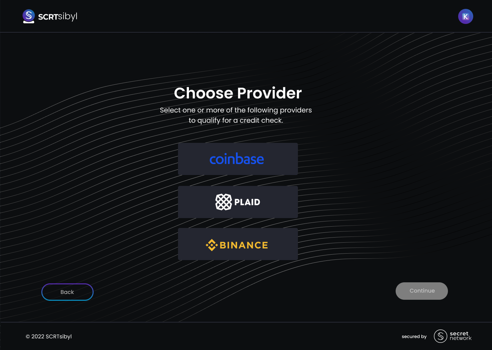
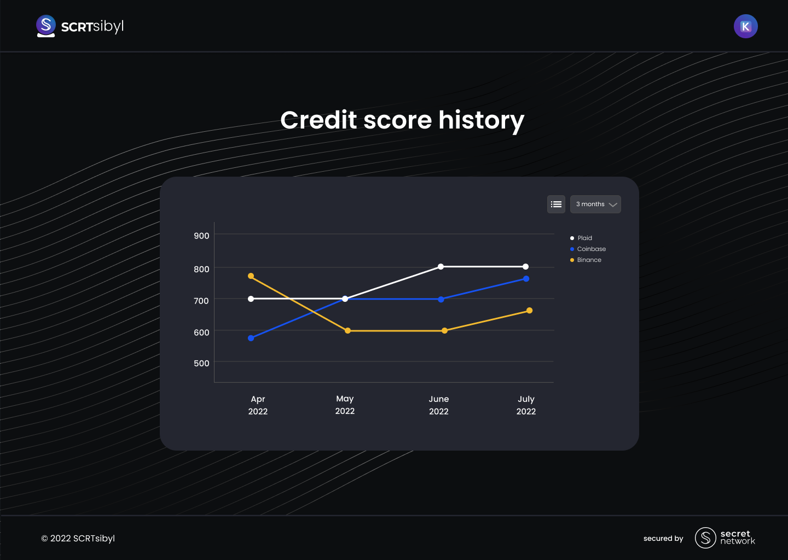
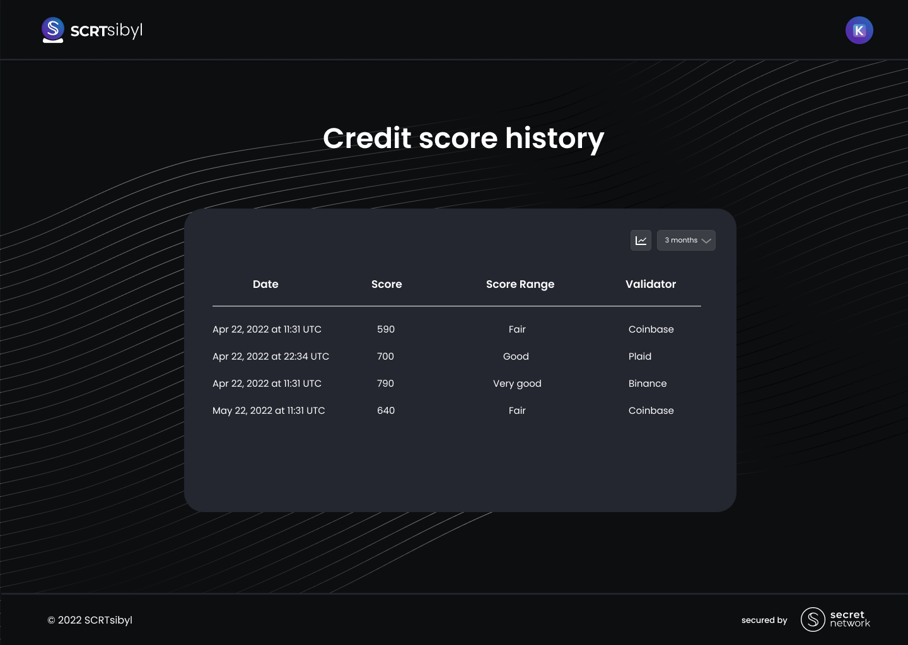
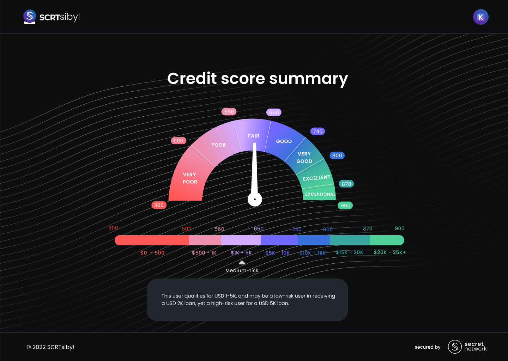
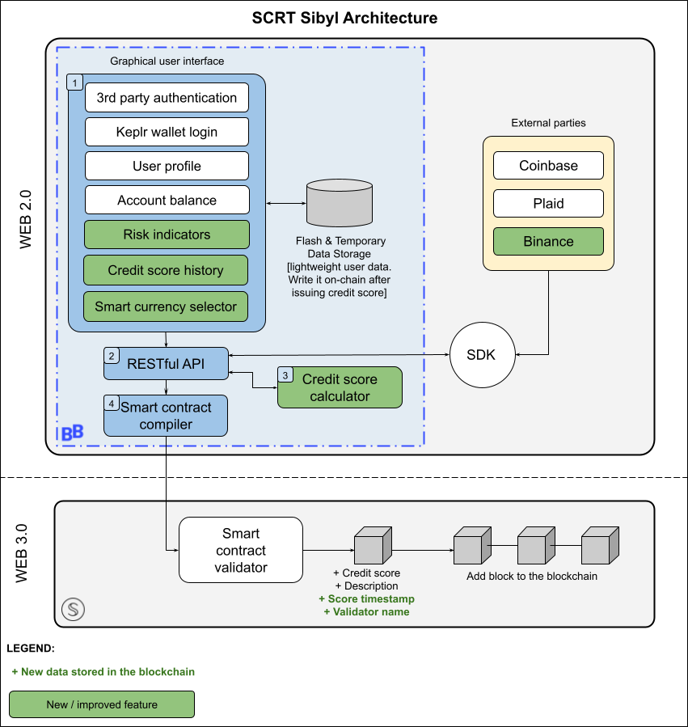

# Team Name: BalloonBox

## Project Description

Project name: **SCRTsibyl_phase2**

SCRTSybil is an oracle for credit score checks developed through an initial Secret Network grant. This is an application to fund a `phase 2` expansion of SCRTsibyl through a second grant.

The SCRTsibyl dApp targets a specific use case: P2P micro-lending, namely facilitating lending and borrowing of microloans ranging between USD 1-25K. As such, the dApp is already able to compute credit scores, to validate users' credibility, and to determine the loan size (in USD) a user qualifies for.

The oracle runs a credit score check on either the user's preferred bank account (integrating through Plaid API) or the user's Coinbase account (integrating through Coinbase API). The credit check assesses the user's financial health and predicts whether the user can pay back their micro-loan. The dApp then executes a smart contract to write and store their score to the Secret Network blockchain.

Throughout the process, users are in control of their own data, which is securely stored on-chain through the privacy-preserving Secret Network protocols. When users store their score on the chain, there are gas fees involved. In order to query their score they can do so one of two ways: `(1)` They create a query permit which would be generated off chain and therefore be costless; OR `(2)` they generate a permission key, which would be stored on chain and would cost gas fees. They can issue viewing keys or the permit queries to third party providers allowing them to query the user's score without any gas fees. If the user would like to revoke their permit queries or change their viewing key, they can do so by running a state-changing function in the smart contract at the cost of a gas fee.

In `phase 2`, we want to both expand our use case including loans of +25K USD, but also increase user adoption by integrating with new data validators and allowing the u ser to self-select the loan currency. In this way, SCRTsibyl will cater to a wide loan range becoming an accessible dApp for an increasingly large pool of crypto investors.

## Problem / Solution

A credit score is a number that expresses your credit information at one point in time. It indicates the risk you represent for lenders, compared with other consumers, on a scale from 300 to 900. High scores on this scale are good. The higher your score, the lower the risk for the lender.

We believe in the value of having a public network with the option and flexibility of data encryption and ultimately believe that mainstream tools for financial services like credit scores will be among the first major requirements for service providers on Secret Network and in the web3 environment.

How can one validate a user's financial pedigree while preserving their privacy? SCRTsibyl allows both. We aim to bring together lenders and borrowers through a dApp designed around the principles of security, data validation, encryption, and data privacy.

## Detailed Product Description :bulb: :high_brightness: :toolbox:

`Phase 2` of SCRTsibyl features the following extensions:

- **Expand validator options**: we will integrate with the Binance API. Binance is a well-established and growing crypto exchange platform. We want to allow those users who don't own a Coinbase wallet to connect their Binance account instead. Thus, users have now the choice to connect either their Coinbase account, their Binance account, or their traditional bank account. Please find a preview of the [validators](./images/validators.png).

- **Add credit score history**: a user's score may change and improve over time and we want to empower users with a positive pedigree to demonstrate their credit history improvement. We'll implement a query function to fetch the chronologically ordered list of their credit scores with associated timestamps. Users will be in control of their credit score history and, if they so choose, they can share it with third parties. Please find previews of the [history chart](./images/history_chart.png) and the [history table](./images/history_table.png).

- **Allow smart currency selection**: the user interacts with the SCRTSibyl UI to custom-choose their preferred currency (fiat or crypto) for score calculation. The dApp will automatically standardize all the metrics in the credit scoring algorithm to the chosen currency. The range of currencies will be initially limited to a predetermined set (USD, EUR, BTC, ETX, USDT, USDC, BNB, XRP). We will integrate with an API (likely [CoinAPI.io](https://github.com/coinapi/coinapi-sdk)) to perform real-time currency conversion.

- **Improve risk indicators**: we will increase the output accuracy of the credit scoring model by returning `low` / `medium` / `high-risk` indicators on the scoring bin assigned to the user. For example, imagine a user qualified for a mini-loan ranging from USD 5-10K. This scoring bin is rather broad, and a user may be very well suited to receive a loan of USD 6K but may struggle to pay back a loan worth USD 9K. Thus, we'll develop three categories to assess the risk level for given users to receive their associated loans. The same user qualifying for USD 5-10K may be a low-risk user in receiving a USD 6K loan, yet a high-risk user for a USD 9K loan. Please find a preview of the [risk indicator](./images/risk_indicator.png).

- **DApp Adoption KPIs**: we will track user adoption for SCRTsibyl. Since the DApp leverages a smart contract to write a score to the blockchain, the DApp leaves a virtual paper trail of all on-chain transactions associated with score calculation. For instance, each transaction sent to the contract originates from a particular Secret Network address. Counting the number of unique Secret Network addresses that submit transactions to the contract (i.e. if a particular address sends five transactions in a day, count them once) will provide a good estimate of the number of users interacting with the DApp. We commit to providing at least 2 KPI indicators. A sample list of adoption KPI indicators follows.

| Indicator | Description        | Measure                                                                                           |
| --------- | ------------------ | ------------------------------------------------------------------------------------------------- |
| TU        | Total Users        | Total number of users that have interacted with the DApp since completion of Phase2.              |
| NU        | New Users          | Number of users storing their credit score to chain for the first time over a selected timeframe. |
| DAU       | Daily Active Users | Number of unique Secret Network addresses that submit transactions to the contract.               |
| UA        | User Adherence     | Number of returning users calculating their credit score repeatedly over time.                    |
| ...       | ...                |                                                                                                   |

### Mockups

### Architecture and Components

For a detailed description of former components, please refer to [phase #1](https://github.com/BalloonBox-Inc/SCRTnetwork_oracle/blob/main/SCRTSybil.md#detailed-product-description) of this oracle.

## Value Capture for Secret Network Ecosystem

As part of the strategy to gain traffic in the Secret Network, we are expanding the access channels to SCRT Sybil credit scoring tool, improving the user experience, and increasing the loan range eligibility. The go-to-market plan plan consists of:

1. User adoption: integrating with Binance will onboard more users since it holds more than 600 cryptocurrencies and it is one of the most popular and largest cryptocurrency exchanges.

2. User experience: tracking credit history and selecting different loan currencies will enhance the whole experience by providing more control to user's own decisions.

3. User loan range: refining the accuracy of the credit score will allow the initial P2P micro-lending loans to increase to up to USD 100,000.

As we expand to more users and improve model accuracy, we strengthen the credibility and robustness of the oracle.

## Company

Company Website - Official Repository

- [BalloonBox](https://www.balloonbox.io/) - [repository](https://github.com/BalloonBox-Inc)

## Team Members :technologist: :woman_technologist:

Personal LinkedIn - GitHub Repository

- [Michael Brink](https://www.linkedin.com/in/michael-brink-680b3767/) - [repository](https://github.com/MichaelBrink)
- [Matteo Mortelliti](https://www.linkedin.com/in/matteo-mortelliti/) - [repository](https://github.com/mmortelliti)
- [Mayllon Miranda](https://www.linkedin.com/in/mayllon-miranda-8aa9b0163/) - [repository](https://github.com/m3mayllon)
- [Irene Fabris](https://www.linkedin.com/in/irenefabris/) - [repository](https://github.com/irene-bbox)
- [Hongbin Lin](https://www.linkedin.com/in/hongbinlin/) - [repository](https://github.com/BalloonBox-Hongbin)
- [Yoon Kim](https://www.linkedin.com/in/imyoonkim/) - [repository](https://github.com/yoon-bbox)

## Team’s Experience

All team members of SCRTSybil are from Balloon Box Technology Inc., a FinTech company based in Vancouver, BC Canada, specialized in software engineering & data science solutions from design through launch. Besides a string of projects for clients all around the world, our team is experienced in developing web apps for crypto asset management, custom Ledger-integrated apps, integrating with PSPs, crpyto exchanges and KYC providers, visualizing big data on L1 & L2s and building wallet solutions. Our team members are proficient in Python, C++, Java, Javascript, and other object-oriented and development languages.

Our team consists of the following roles:

- Product Architect (Full product architecture)
- Full Stack Engineer (Core framework)
- Designer (UI/UX on the web application)
- Backend Engineer (APIs, database structure, DevOps)
- Data Scientist (x2) (Credit Score algorithm + build)
- Product Manager (Community, articles, GitHub house-keeping, managing public PRs)

## Development Roadmap :nut_and_bolt: :gear: :hammer_and_wrench:

### Overview

- **Total Estimated Duration:** 13 weeks
- **Full-Time Equivalent (FTE):** 3.1
- **Total Costs:** USD 105,000

Our team will require 3.5 months to complete this project (subject to a mutually agreed upon solution design that both Bbox and SCRT feel excited about). We intend to have 2 developers full-time, 1 data scientist full-time, and 1 UX/UI designer part-time, a product architect, and a project manager. We can receive payments in 4 disbursements, one at the beginning of the grant, three after completion of each milestone.
We would be willing to consider part payment (up to 50%) in SCRT, BTC or ETH. The grant can be paid to either of the following addresses:

- BTC address: bc1qz36smg7zg9d2de7qurj9a49fetemavta39a9zp
- ETH address: 0x3ffA0e66091742a867430D140E36826c06ba19Be
- SCRT address: secret18qeg7lx63wkqvy9e295slufvch5rfel2v23tsu

**Initial amount at grant issuance:** USD 15,000

### Milestone 1 - APIs, Integration, Credit Score Algorithm

- **Estimated duration:** Week 1-8
- **Costs:** USD 40,000

| Number | Deliverable       | Specification                                             |
| -----: | ----------------- | --------------------------------------------------------- |
|    0a. | License           | Apache 2.0                                                |
|    0b. | Documentation     | Provide inline documentation of the code.                 |
|    1a. | API module        | Build Binance validator.                                  |
|    1b. | API module        | Build currency selector.                                  |
|    1c. | API module        | Refine risk model.                                        |
|     2. | Data Cleaning     | Setup VM with sufficient resources for score computation. |
|     3. | Data Integration  | Overlay web2 with web3 validation data for the new API.   |
|     4. | AI Module - Build | Build a light AI model to calculate user credit score.    |

### Milestone 2 - Test and Validation

- **Estimated duration:** Week 9-10
- **Costs:** USD 20,000

| Number | Deliverable        | Specification                                                                                                                                                        |
| -----: | ------------------ | -------------------------------------------------------------------------------------------------------------------------------------------------------------------- |
|    0a. | License            | Apache 2.0                                                                                                                                                           |
|    0b. | Documentation      | We will provide inline documentation of the code.                                                                                                                    |
|    0c. | Test Guide         | Run unit tests to ensure functionality and robustness of core functions (~70%).                                                                                      |
|     1. | AI Module - Deploy | Train, test, deploy the upgraded AI model and compute credit scores.                                                                                                 |
|    2a. | Contract           | Add 2 fields to the data currently stored in the smart contract: `(a)` score timestamp and `(b)` validator used in the score calculation (Plaid, Coinbase, Binance). |
|    2b. | Contract           | Execute the smart contract, written in Rust, to encrypt the calculated credit score to Secret Network blockchain.                                                    |

### Milestone 3 - WebApp: Framework + UI and KPIs

- **Estimated duration:** Week 11-13
- **Costs:** USD 30,000

| Number | Deliverable   | Specification                                                                                                         |
| -----: | ------------- | --------------------------------------------------------------------------------------------------------------------- |
|    0a. | License       | Apache 2.0                                                                                                            |
|    0b. | Documentation | We will provide inline documentation of the code for the WebApp framework.                                            |
|     1. | Framework     | Implement Keplr wallet Login, personal info input, hover+select+OAuth2 in chosen validator                            |
|     2. | UI Module     | Design the UI flow for retrieving the score history.                                                                  |
|     3. | UI Module     | WebApp aesthetics and functionalitiy refinements.                                                                     |
|     4. | KPI           | Measure and store basic stats on DApp user adoption                                                                   |
|     5. | Tutorial      | We will publish a video tutorial that walks a user through the SCRTSybil WebApp instructing them on the new features. |

## Additional Information :heavy_plus_sign: :dart: :pushpin:

### Why SCRT?

1. **How did you hear about the Secret Network grants?** We have been collaborating with the SCRT Labs Team for the last 4 months and we are just about to complete and release the very first Credit Score Oracle we developed for the Secret Network.

2. **Have you ever applied for other grants?** Yes, this is a follow-up grant to expand the work we completed after the first SCRT grant we received in January 2022.

### Future Plans

1. **Subscription**

   Develop a membership plan to allow users to have their credit scores updated every month so they can even more demonstrate their credibility.

2. **Blacklisting**

   Develop a feature to red flag or blacklist late payers and bad payers to avoid distrusted users or potential defaults.

3. **Machine Learning**

   Develop Machine Learning models alongside the credit scores so that users do not need to trust a single specific entity fully.
